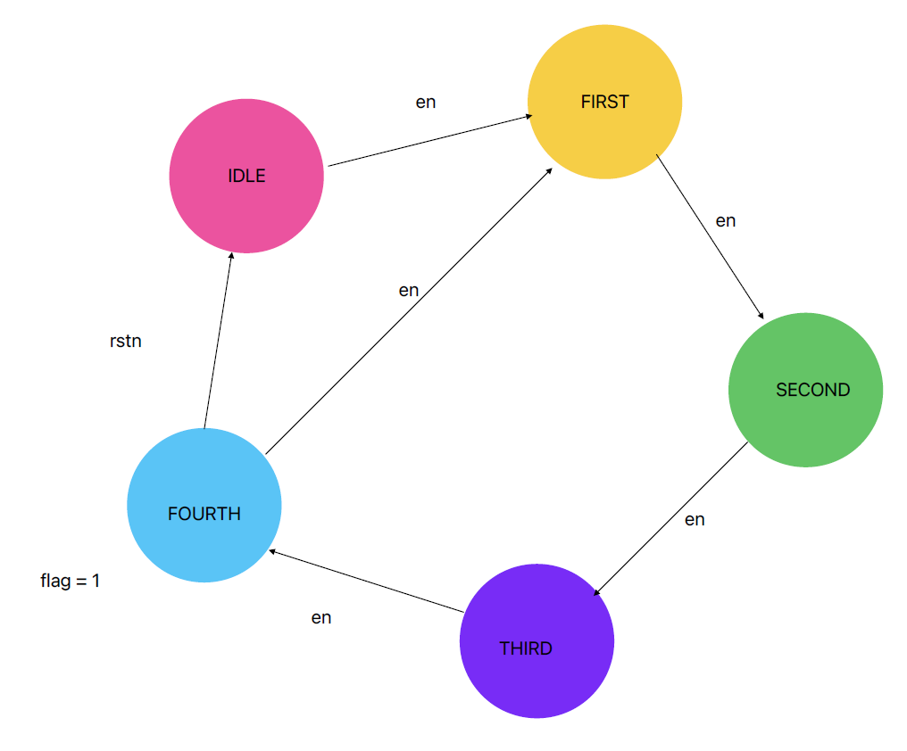
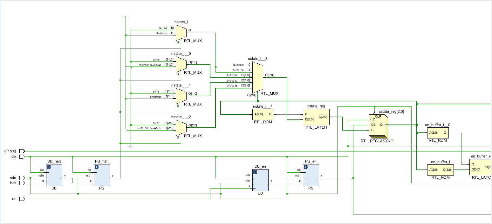
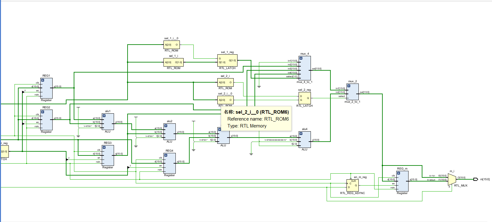
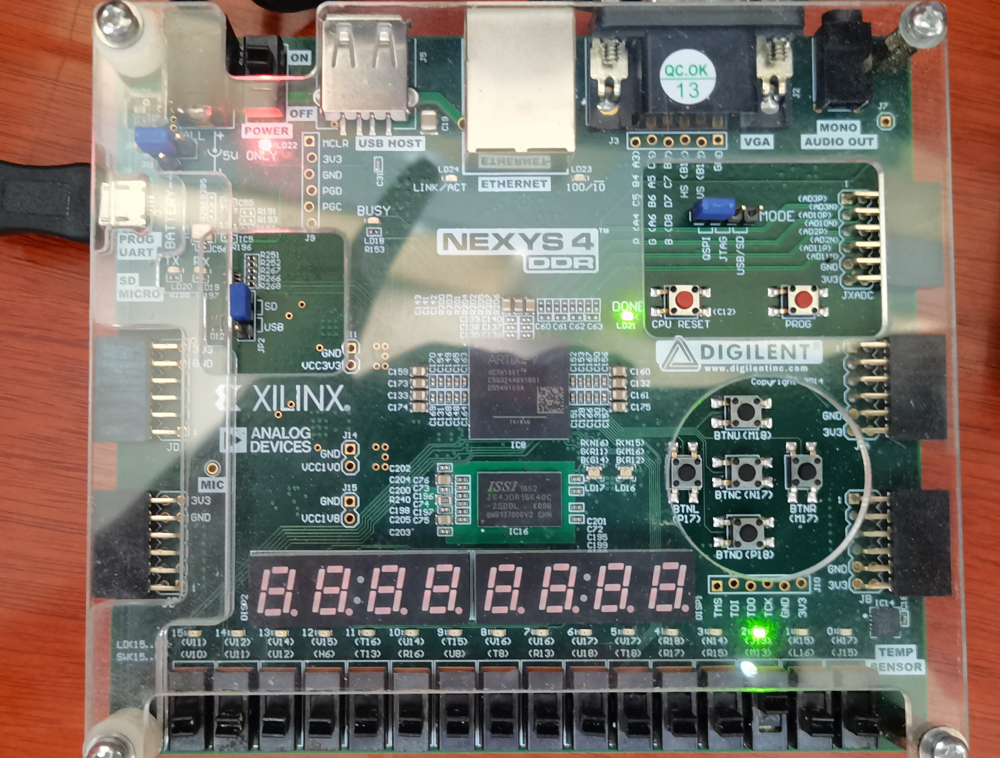
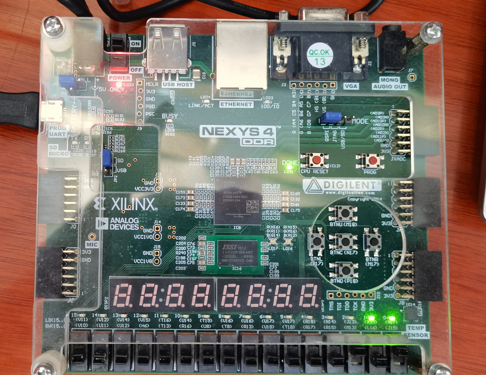
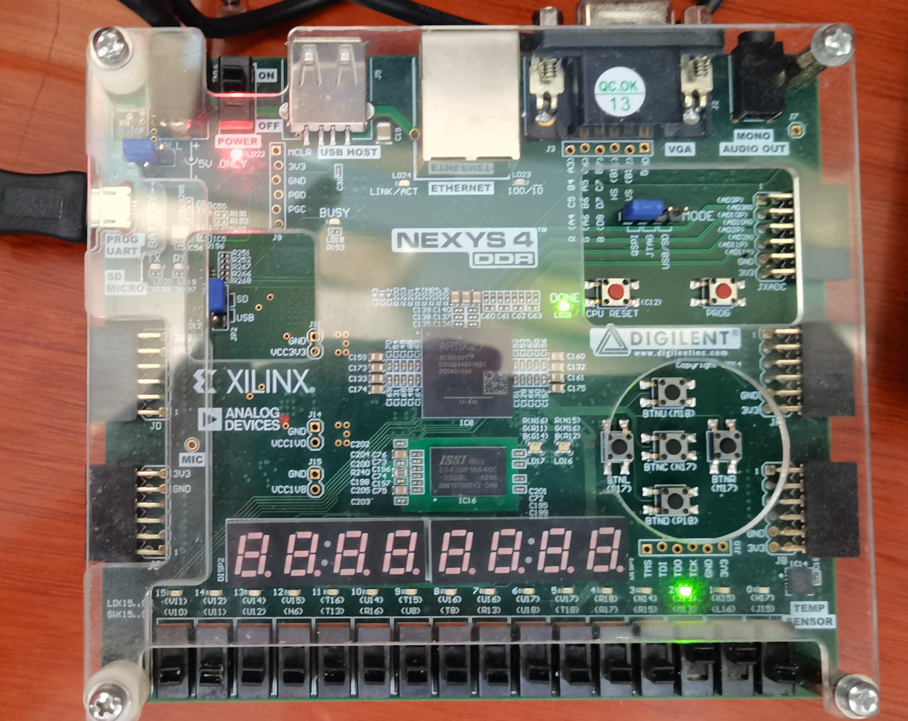
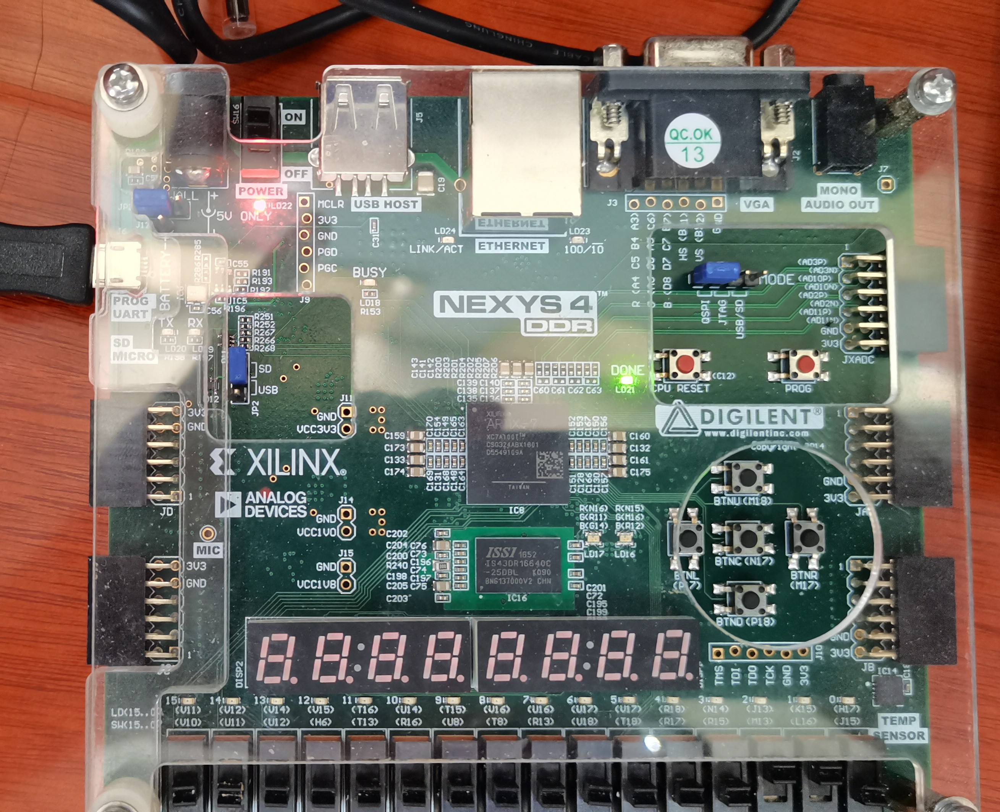

## LABH1 Report

### 实验目的及内容

- 本次实验要求使用`Verilog`语言编写`CPU`中的计算模块`ALU`，并调用其输出四个数的滑动平均。

### 逻辑设计

- 状态机及状态转换图
  
  首先为了求四个数的滑动平均，我们先要保存四个数，构造如下的输出缓冲区：
  
  ```v
  wire [15: 0] buffer [3: 0];                       //最近四个数的缓冲区
  reg  [1: 0]  pointer;                             //缓冲区指针
  reg  [3: 0]  en_buffer;                           //四个缓冲区的使能
  ```
  
  其中`buffer`表示输入缓冲区，又因为我们需要控制输入的时机，故把每个缓冲区都设置了一个**输入使能**。使用缓冲区指针进行**循环输入**（类似循环队列）。
  
  并且，题目要求在前三个数输入时输出对应的三个数，但在第四个数输入及之后就需要实时地输出最近输入四个数的平均数。所以状态机必然至少 $5$ 个状态，包括初始状态，输入第模4余1个数，输入第模4余2个数，输入第模4余1个数，输入模4余0个数。还要设置一个标志$flag$，标志这是不是前三次输入。
  
  所以状态机为：
  
  

- 核心代码分析
  
  - 在`ALU`中的核心代码（有符号数的比较大小）
  
  ```v
   if(a[WIDTH - 1] == 0 && b[WIDTH - 1] == 1) begin  //a > b
              lt = 0;
          end
          else if(a[WIDTH - 1] == 1 && b[WIDTH - 1] == 0) begin  
                                                       //a < b
              lt = 1;
          end
          else if(a[WIDTH - 1] == 0 && b[WIDTH - 1] == 0) begin
                                                        //a, b均为正 
              if(a[WIDTH - 2: 0] < b[WIDTH - 2: 0]) begin
                  lt = 1;
              end
              else begin
                  lt = 0;
              end
          end
          else begin                                     //a, b均为负
              if(a[WIDTH - 2: 0] >= b[WIDTH - 2: 0]) begin
                  lt = 0;
              end
              else begin
                  lt = 1;
              end
          end
  ```
  
  - 在`MAV`中的核心代码（开放缓冲区使能的位置，以前两个状态为例）
  
  ```v
  IDLE: begin
                  pointer = 0;
                  en_buffer[0] = 1;
                  en_buffer[1] = 0;
                  en_buffer[2] = 0;
                  en_buffer[3] = 0;
                  sel_1 = 2'b00;
                  sel_2 = 1'b0;
                  flag = 0;
                  nstate = FIRST_NUM;
              end
              FIRST_NUM: begin
                  pointer = 1;
                  en_buffer[0] = 0;
                  en_buffer[1] = 1;
                  en_buffer[2] = 0;
                  en_buffer[3] = 0;
                  sel_1 = 2'b01;
                  if(flag) begin
                      sel_2 = 2'b1;
                      flag = 1;
                  end
                  nstate = SECOND_NUM;
              end
  ```

### 仿真结果及分析

- ALU仿真结果
  
  

- MAV仿真结果
  
  

- 结果分析
  
  可以看出，仿真后，输入前三个数时，输出m即为前三个数，输入第四个数及之后，输出m即为四个数之平均数。

### 电路设计及分析

- 完整`RTL`电路图
  
  
  
  

- 资源使用情况
  
  
  
  可以看出`WNS`为正数。

### 测试结果及分析

- 上板结果
  
  输入$2,3,4,5,6$，并之后输入`rstn`：
  
  - 输入$2$：
    
    
  
  - 输入$3$：
    
    
  
  - 输入$4$：
    
    
  
  - 输入$5$：计算出$3,4,5,6$的平均数为$3$。
    
    
  
  - 输入$6$：计算出$4,5,6,7$的平均数为$4$。
    
    
  
  - 输入`rstn`：
    
    
