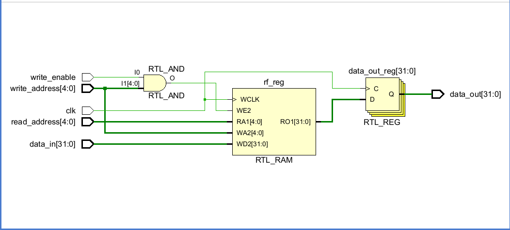
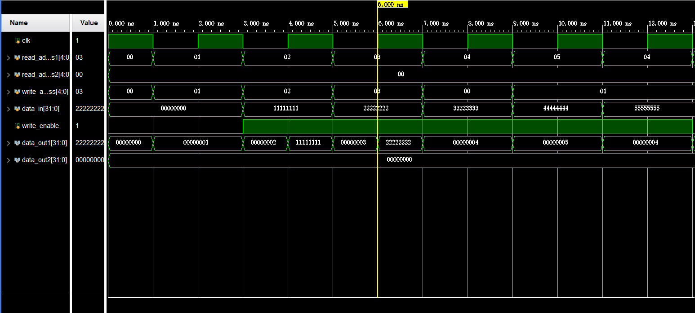
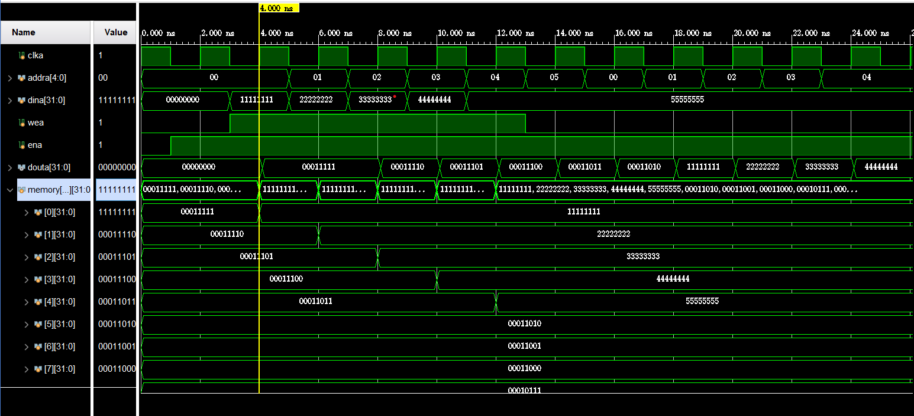
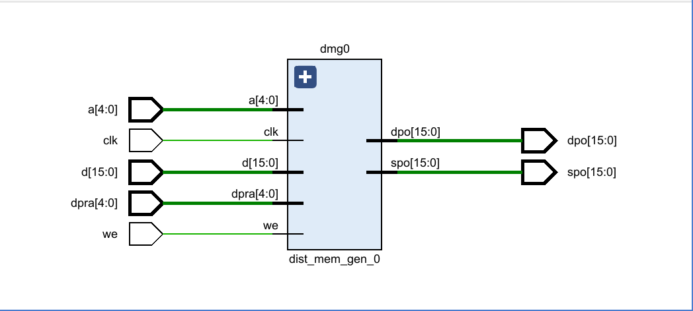
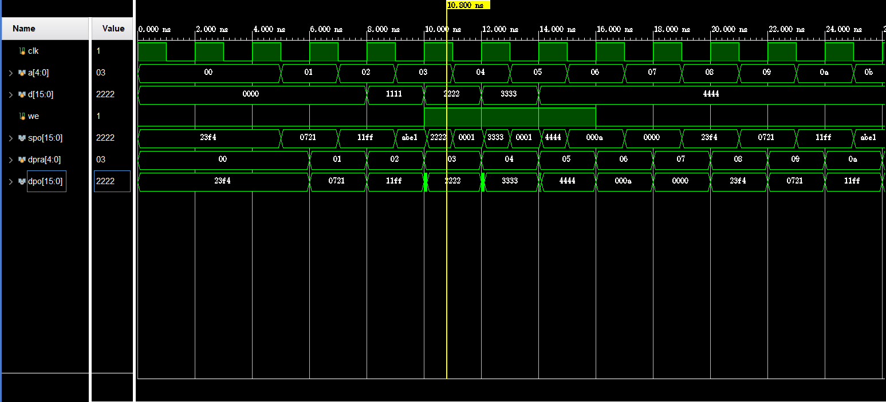
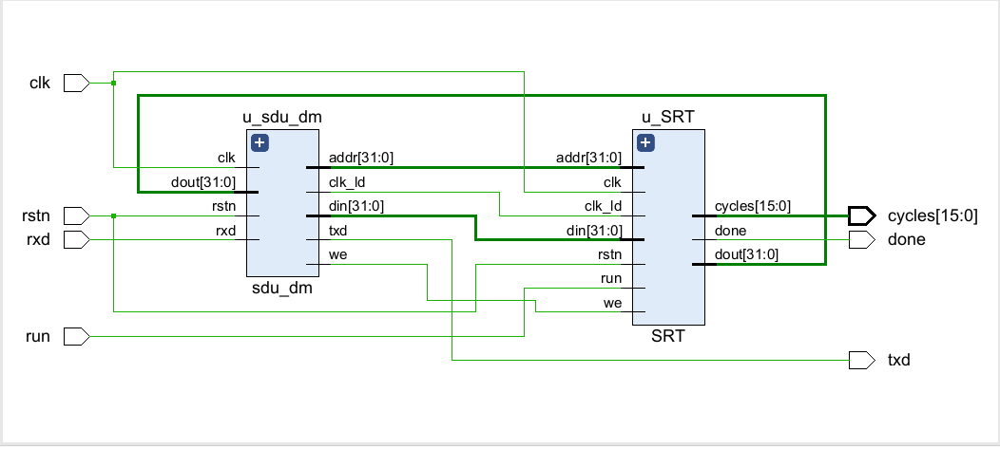
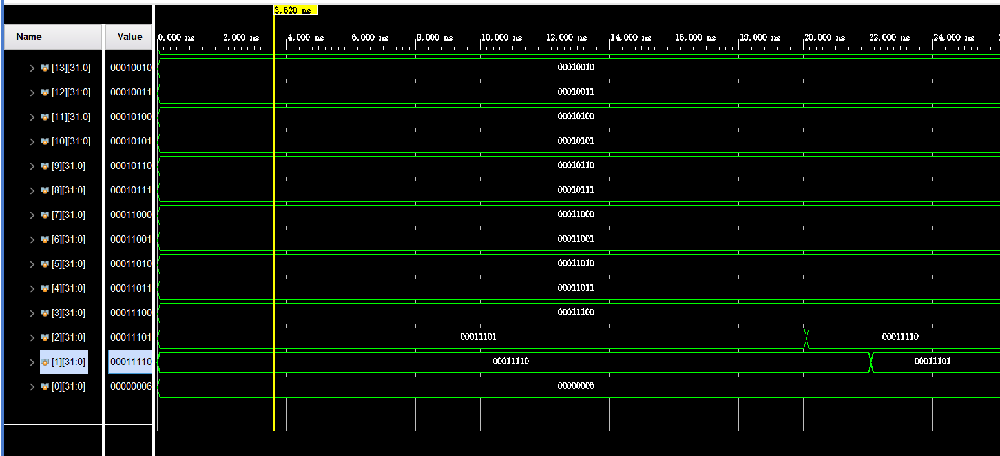
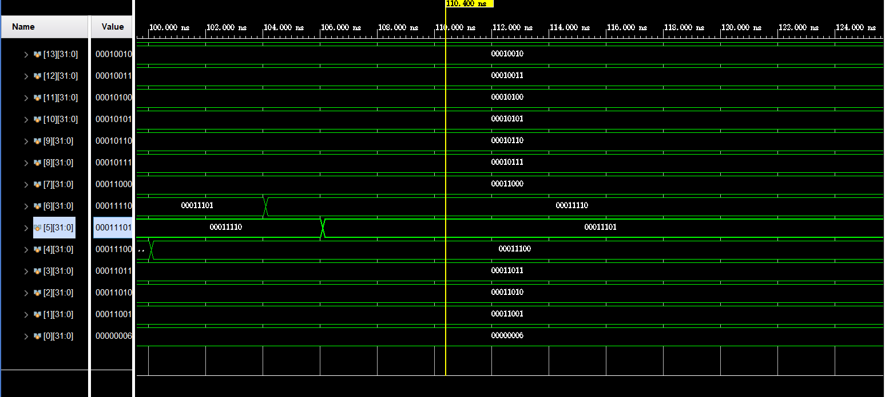
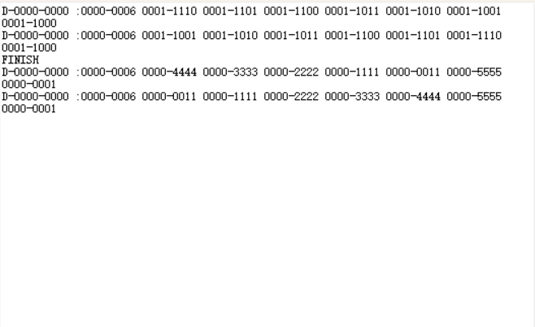
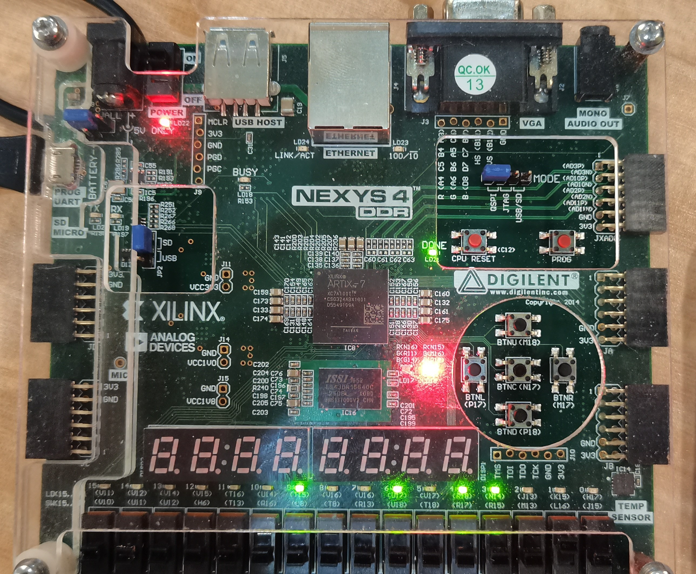

## LabH2 Report

- [LabH2 Report](#labh2-report)
  - [实验目的及内容](#实验目的及内容)
  
  - [逻辑设计](#逻辑设计)
  
  - [仿真结果及分析](#仿真结果及分析)
  
  - [电路设计及分析](#电路设计及分析)
  
  - [测试结果及分析](#测试结果及分析)
  
  - [总结](#总结)

### 实验目的及内容

- 本次实验实现了优先读的存储器时序，并且利用分布式双端口存储器ip核实现了寄存器堆的排序以及使用串行调试单元进行调试

### 逻辑设计

- 状态机及状态转换图
  
  
  排序需要考虑变长数组，而数组的长度被保存在第零位，故在排序开始之前需要先在一个时钟周期内读取数组的大小。在`GET_DATA_AND_INDEX`状态之前，`IDLE`之后需要加额外的一个状态，我们将其命名为`READ_SIZE`状态，将地址定为`0`，读出该地址的值，保存在寄存器内，作为排序数组的大小。

- 核心代码分析
  $32\times32$位寄存器堆
  
  ```v
  module RF_1(
    input clk, // 时钟信号
    input [4: 0] read_address1, // 读地址信号
    input [4: 0] read_address2,
    input [4: 0] write_address, // 写地址信号
    input [31: 0] data_in, // 写入数据信号
    input write_enable, // 写使能信号
    output  [31: 0] data_out1, // 读出数据信号
    output  [31: 0] data_out2
  );
  //Write First Mode
  //address is 32 bits
  //data is 32 bits
  
  reg [31: 0] rf [0: 31]; // 存储器数组，256个8位单元
  
  always @ (posedge clk) begin
    if (write_enable && write_address) begin
      //写入有效且写入地址不为0
      rf[write_address] <= data_in; // 写入数据
    end
    rf[0] <= 0;
  end
  assign  data_out1 = rf[read_address1]; // 读出数据
  assign  data_out2 = rf[read_address2];
  integer  i;
  initial begin
      for (i = 0; i < 32; i = i + 1)begin
          rf[i] = i;
      end
  end
  
  endmodule
  ```
  
  `SRT`的接口选择：其中`flag`是运行标志，1标志排序正在运行，0标志排序不在进行或排序已结束。
  
  ```v
  assign a = (flag) ? index_1 : addr;
     //assign spo = data_1;
     assign dpra = index_2;
     //assign dpo = data_2;
     assign d = (flag) ? write_data : din;
     assign dout = spo;
     assign clk_a = (flag) ? clk : clk_ld;
  ```

### 仿真和RTL

- 完成$32\times32$位寄存器堆的功能仿真
  
  自己写的：
  
  - `RTL`电路图
    
    
  
  - 仿真结果
    
    
    使用`block memory generator`的优先读式`ip`核，可得如下仿真结果：
    
    

- `SRT`排序模块
  
  - 分布式双端口存储器的`RTL`分析图
    
    

- 分布式双端口存储器的仿真
  
  
  
  可以看出
  
  ```v
  assign spo = mem[a];
  assign dpo = mem[dpra];
  ```
  
  但是dpo在修改内容之后会有一次滞后。

- SRT模块的`RTL`图
  
  

- SRT模块的仿真
  
  初始情况：
  
  
  
  排序完成时的情况
  
  
  
  可见排序结果是正确的。

- `SDU`串行调试单元
  
  - 调试结果
    
    
    
     `FINISH`是`LD`指令的结果，`LD`的内容在`FINISH`下方的一行。可见排序结果的正确性。

### 上板结果


