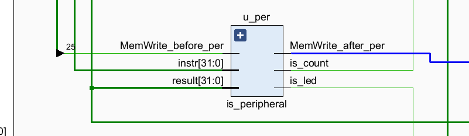

## LABH4 Report

### 实验目的及内容

- 本次实验需要使用`Verilog`语言实现单周期`CPU`，并使用`XCOM`串行调试工具进行`CPU`功能的调试，同时实现`MMIO`（内存映射IO），当检测到对应地址（`0x7f20 stand for counter`以及`0x7f00 stand for LED`）时，输入或输出对应的信息到开发板LED或保存数据在寄存器中。

### 逻辑设计

- 核心代码分析
  
  本实验`CPU`所使用的数据通路如下：
  
  
  
  其中相比于书本的数据通路有一定的不同，如：
  
  1、`ALU`的输出从`t[2: 0]`变为`Zero`和`Less`，即不区分无符号小于和有符号小于。
  
  2、`NPC`的生成元进行了丰富：`PCAsrc`和`PCBsrc`分别选择了`4,Imm`和`rs1,PC`，这是为了满足更多指令的需求。
  
  3、 去除了`MemRead`，认为从存储器读数据不需要条件。
  
  4、修改了`Branch`，将分支跳转的控制信号生成器统一放在`Control`中，并生成上述`PCAsrc`和`PCBsrc`两个信号。
  
  5、修改了ALU的输入，支持更多输入源保证CPU能支持更多指令并增强其可扩展性。
  
  6、在中央控制区，增加了`func3`和`func7`以进行更多riscv指令的选择。

### 电路设计及分析

- 完整`RTL`电路图
  
  ### 
  
  可以看到，除了将CPU与串行调试工具接线之外，从CPU中又额外分出若干条线，接入程序计数器以及`LED`，保证若在汇编程序中写如下代码：
  
  ```v
  .data:   
      LED: .word 0x7f00
      COUNTER: .word 0x7f20
  .text:
      la a5 , COUNTER           # a5 = addr of COUNTER
      lw a5 , 0(a5)             # let a5 = 0x7f20
      lw a5 , 0(a5)             # do not let a5 = M[0x7f20] 
  #
  #具体程序
  #
      la a6, COUNTER
      lw a6, 0(a6) 
      lw a6, 0(a6)
  
      addi a5, a6, a5 
  
      la a7, LED
      lw a7, 0(a7)          # a7 = 0x7f00
      sw a5, 0(a7)          # do not let M[0x7f00] = a5
  ```
  
  此时两个程序计数器模块会分别将数据保存在counter模块中的两个寄存器中，用于记录程序开始和结束的时间。检测到LED模块时，将这两个寄存器的值相减并输出在开发板的LED灯上。
  
  这两个指令，`CPU`并不会将其解释为真正的`lw`和`sw`指令，而是会解释成`MMIO`，出现这两个地址说明保存程序计数器的值到寄存器中或将寄存器输出到LED上。这个工作是由CPU的一个添加的模块实现的：
  
  
  模块检测了`MemWrite`，若为上述`sw`指令则将对应控制置零，不允许寄存器的值写入存储器，并输出`is_count`和`is_led`信号进行选择输入或保存到`led`。

### 测试结果及分析

- 上板结果
  
  - 测试
    
    测试成功的标志是`t5(RU)`被置`1`。
    
    
    
    上图中运行了以下指令：
    
    ```txt
    D 0000-0000
    I 0000-0000
    T             # 跑一个时钟周期
    R
    D 0000-0000   # 查看寄存器和存储器
    G
    H             # 一直运行
    R             # 查看结果
    ```
    
    可以看到，最终程序运行结束时，`RU`被置`1`，表明18条指令正确。
  
  - 排序
    
    排序开始前数组为：`5,5,3,8,4,2`其中第一位表示数组大小。
    
    排序结束后：
    
    
    
    上图中运行了以下指令：
    
    ```txt
    LD
    D 0000-0000   # 查看LD之后的存储器内容
    I 0000-0000   # 查看LI之前的存储器内容
    LI 
    I 0000-0000   # 查看LI之后的存储器内容
    G
    H
    D 0000-0000   # 查看运行结果 
    R
    ```
    
    可以看到排序已经完成，并且存储器的值被修改为`5,2,3,4,5,8`，说明排序结果正确。
    
    排序结束后，在`RE`输出`LED`，代表了该程序所用的时钟周期：
    
    

### 总结

SDU写的很好，就是必须三个换行符结尾太难受了，每次导出COE文件都得手动加换行符。。。。