# 流水线CPU串行调试单元SDU

<center>written by PB21111706 常文正</center>

> 很荣幸能为H班的同学们再次提供SDU_PL版，相较于之前的单周期SDU，其实也就是多了一些数据通路的信号线，在使用方法上相较于单周期SDU并无太大差别，因此本Readme重点内容在介绍接线含义部分，其他部分相较于之前的版本无太大修改。

> 同时，SDU仅仅推荐作为上板结果检验的工具，在代码正确性测试环节还是用仿真更加方便快捷！如果遇到上板后串口无反应，请检查自己的代码是否包含latch，reg_init等warnings，cpu部分的代码错误仍可能导致上板后Xcom无反应！

## 特别感谢

**SDU小组成员：**

PB21111706 常文正
PB21111725 于硕
PB21111708 刘睿博
PB21111742 王以勒
PB21111696 闫泽轩

> 这个巨大的工程耗费了我们大量的时间精力，感谢所有组员对SDU的贡献。

## SDU简介

### SDU是什么

SDU：Serial Debug Unit，通过串口对CPU进行调试

- 控制运行方式：单周期或者支持断点的连续运行
- 查看运行状态：数据通路状态、寄存器堆和存储器内容
- 加载存储器：初始化指令存储器和数据存储器

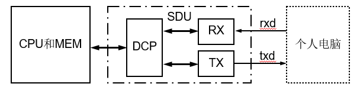

> RX：Receiver，接收器
> 
> DCP：Debug Command Processing，调试命令处理
> 
> TX：Transmitter，发送器 

### SDU的接口功能

将本SDU文件夹import到工程中后，RTL电路应该长这样：

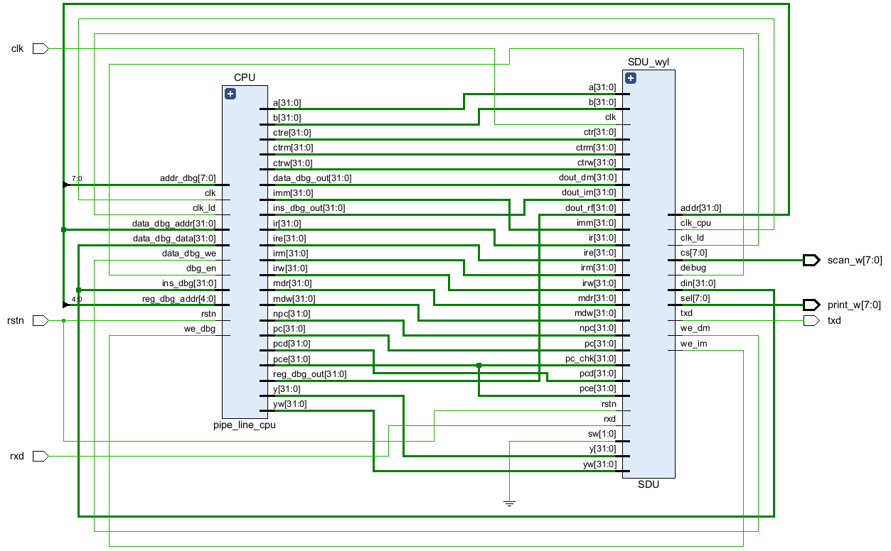

#### 控制CPU运行方式

工作时钟：clk_cpu

当前执行指令指针：pc_chk

#### 查看CPU运行状态

数据通路：npc, pc, ir, …

寄存器堆：addr, dout_rf

存储器：addr, dout_dm, dout_im

#### 加载指令和数据存储器

写时钟：clk_ld

写地址：addr

写数据：din

写使能：we_dm, we_im

#### 顶层模块接线

CPU和SDU之间的连线我已经在最顶层模块文件中标识出各条线的含义，注意阅读（尤其是addr往后的部分）

> 俗话说得好，接线接得好，调试没烦恼，根据一些我之前写流水线的经验来看，各种接线的位宽和名称一定要看准了，每次定义一个就写一个，不然很容易漏掉、写错、错位、大小写等各种问题会调很久。

```verilog
    wire clk_cpu;
wire [31:0] pc_chk; //用于SDU断点检查，在流水线cpu中，pc_chk = pce(也就是EX阶段的pc)
    wire [31:0] npc;    //npc就是IF阶段pc_reg中的npc
    wire [31:0] pc;     //pc就是IF阶段pc_reg中的pc
    wire [31:0] ir;     //ir就是ID阶段的ins_D
    wire [31:0] pcd;    //pcd就是ID阶段的pc
    wire [31:0] ire;    //ire就是ID阶段的ir
    wire [31:0] imm;    //imm就是ID阶段的imm
    wire [31:0] a;      //a就是EX阶段ALU的a
    wire [31:0] b;      //b就是EX阶段ALU的b
    wire [31:0] y;      //y就是EX阶段的ALU_out
    wire [31:0] pce;    //pce就是EX阶段的pc
    wire [31:0] ctr;    //ctr就是EX阶段的ctre(控制信号总线)
    wire [31:0] irm;    //irm就是MEM阶段的ir
    wire [31:0] mdw;    //mdw就是EX向MEM阶段传入的Rs2_data(mem_data_write)
    wire [31:0] ctrm;   //ctrm就是MEM阶段的ctrm(控制信号总线)
    wire [31:0] irw;    //irw就是WB阶段的ir
    wire [31:0] yw;     //yw就是WB阶段的y
    wire [31:0] mdr;    //mdr就是WB阶段的mem_data_read
    wire [31:0] ctrw;   //ctrw就是WB阶段的ctrm(控制信号总线)
    /*
    addr是SDU输出给cpu的地址，
    cpu根据这个地址从ins_mem/reg_file/data_mem中读取数据，三者共用一个地址！
    注意，这个地址是你在串口输入的地址，不需要进行任何处理，直接接入cpu中的对应模块即可
    dout_rf 是从reg_file中读取的addr地址的数据
    dout_dm 是从data_mem中读取的addr地址的数据
    dout_im 是从ins_mem中读取的addr地址的数据
    din 是SDU输出给cpu的数据，cpu需要将这个数据写入到addr地址对应的存储器中
    we_dm 是数据存储器写使能信号，当we_dm为1时，cpu将din中的数据写入到addr地址对应的存储器中
    we_im 是指令存储器写使能信号，当we_im为1时，cpu将din中的数据写入到addr地址对应的存储器中
    clk_ld 是SDU输出的用于调试时写入ins_mem/data_mem的时钟，要跟clk_cpu区分开，这两个clk同时只会有一个在工作
    debug 是调试信号，当debug为1时，cpu的ins_mem和data_mem应使用clk_ld时钟，否则使用clk时钟
    */
    wire [31:0] addr;   
    wire [31:0] dout_rf;    
    wire [31:0] dout_dm;
    wire [31:0] dout_im;
    wire [31:0] din;
    wire we_dm;
    wire we_im;
    wire clk_ld;
    wire debug;
```

这次上板结果：

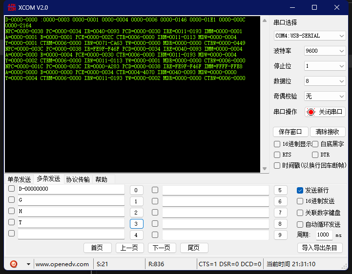

## SDU功能

### 命令总览

•**控制运行方式**

– T：S**t**ep, CPU单步运行，运行1个时钟周期即停止

– B：**B**reakpoint, 设置/删除/查看断点，最多可有2个断点

– G：**G**o, CPU连续运行，遇到断点或收到停止命令H则停止

– H：**H**alt, 停止CPU运行

•**查看运行状态**

– P： Data**p**ath, 查看数据通路状态

– R：**R**egister File, 查看寄存器堆内容

– D：**D**ata Memory, 查看数据存储器内容

– I：**I**nstruction Memory, 查看指令存储器内容

•**加载存储器**

– LI：**L**oad **I**nstruction, 将程序加载至指令存储器

– LD：**L**oad **D**ata, 将数据加载至数据存储器

### 控制指令

- **P：Datapath, 查看数据通路状态**
  依次输出数据通路中npc, pc, ir, ctl, a, b, imm, y, mdr等内容
  电脑端显示格式：NPC = xxxx_xxxx   PC = yyyy_yyyy  ……
- **R：Register File, 查看寄存器堆内容**
  addr从0递增，依次输出dout_rf，即寄存器堆32个寄存器内容
  电脑端显示格式：R0 = 0000_0000  R1= xxxx_xxxx  ……
- **D [a]：Data Memory, 查看数据存储器内容**
  a为16进制起始字地址，缺省时为上次查看结束地址 (复位时为0)
  addr从a递增，依次输出dout_dm，即数据存储器地址a开始8个字
  电脑端显示格式： D-xxxx_xxxx:  yyyy_yyyy  zzzz_zzzz ……
- **I [a]：Instrction Memory, 查看指令存储器内容**
  其他同上，依次输出dout_im，即指令存储器地址a开始8个字
  电脑端显示格式： I-xxxx_xxxx:  yyyy_yyyy  zzzz_zzzz ……

#### 使用示例：

多次使用D指令，可以看到在没有参数的情况下，会默认每次从上一次结束的地址开始新一轮的输出：

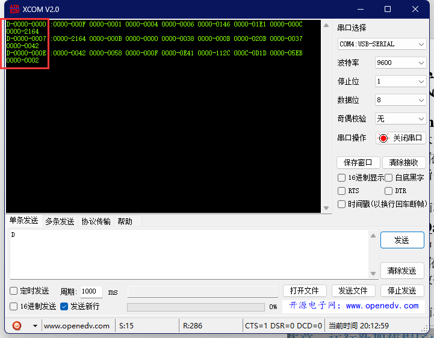

加入参数，注意参数必须写满8位（16进制）的地址，即可从指定地址开始输出：

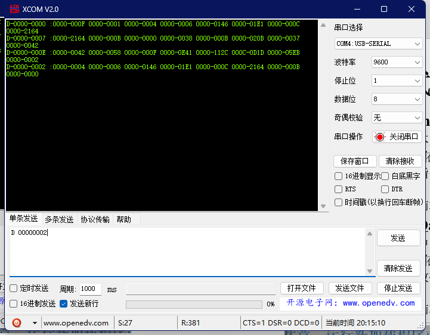

这里以D指令为例，其他指令同理。

### 查看指令

- **T：Step，CPU单步运行**
  输出1个clk_cpu周期后，执行P命令，显示数据通路状态

- **B [a]：Breakpoint，设置/删除/查看断点**
  a为可选的16进制断点，B：显示所有断点，最多可有2个断点

- **B a：**
  
  如果当前断点中不存在a，且未满2个断点，则设置a断点；如果当前断点中已有a，则删除之；无论如何均显示所有断点

- **G：Go，CPU连续运行**
  输出1个clk_cpu周期后，检查pc_chk是否等于断点，以及是否接收到停止命令H
  如果结果均为否，则重复上述过程，否则执行P命令，显示数据通路状态

- **H：Halt，CPU停止运行**
  如果执行G命令时，CPU运行不止，H命令可强制停止

#### 使用示例：

使用T指令单走一个周期：

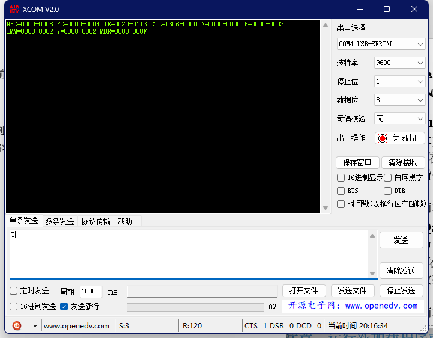

设置断点为0000000C：（初始状态下两个断点默认都是FFFF-FFFF，注意这个断点设置必须要为4的倍数，因为pc每次加4，所以如果不设置为4的倍数断点设置就是无效的)

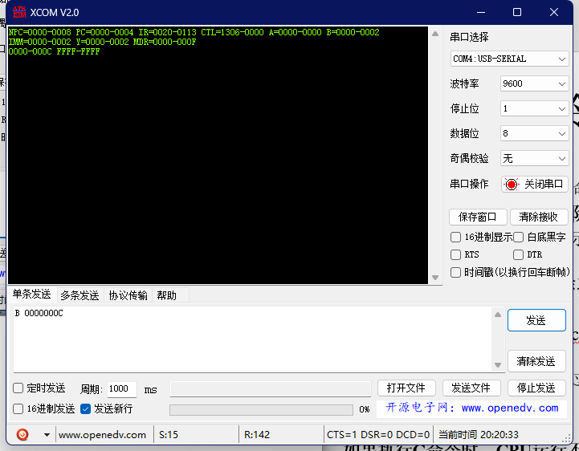

输入G指令，让cpu开始跑，在断点0000-000C处自动停止并输出数据通路。

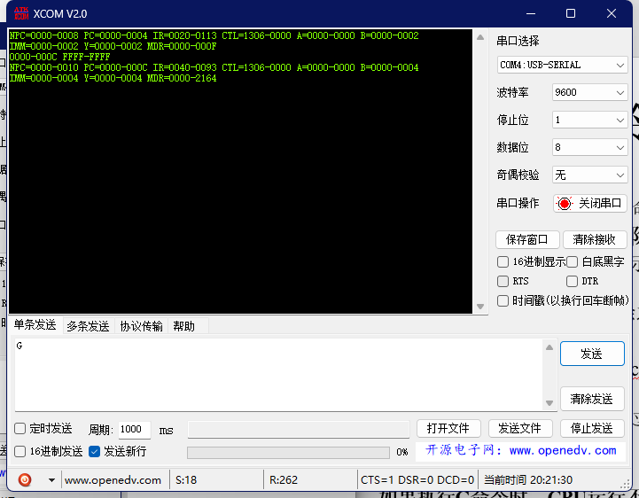

### 加载指令

- **LI 文本文件：Load Instruction, 加载指令存储器**
  机器码程序存储在文本文件中，每行对应一条16进制指令码
  addr从0开始递增，din依次为文件一行数据，we_im = 1，clk_ld产生一个脉冲，写入指令存储器一条指令，直至文件结束（空白行）
  全部写入结束后，电脑端输出：Finish
- **LD文本文件：Load Data, 加载数据存储器**
  数据存储在文本文件中，每行对应一条16进制数据字
  addr从0开始递增，din依次为文件一行数据，we_dm = 1，clk_ld产生一个脉冲，写入数据存储器一个数据，直至文件结束（空白行）
  全部写入结束后，电脑端输出：Finish

> 注意：运行加载命令或使用加载数据前务必复位系统！

#### 使用示例：

以LD示意，LI同理，先用D指令查看data_mem中数据是什么样子的：

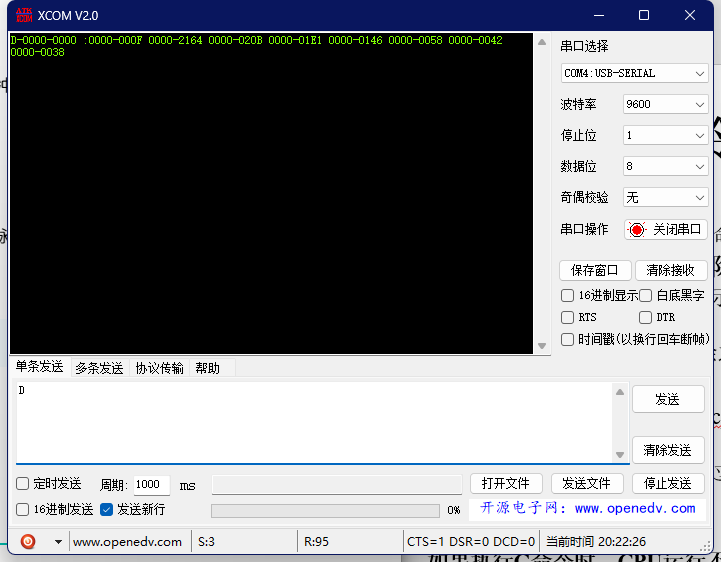

然后输入LD指令，直接点击发送

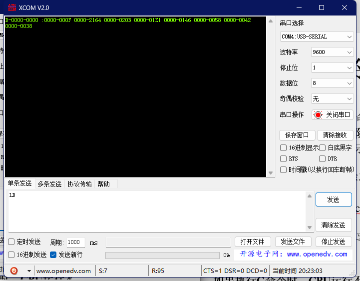

这个时候发现SDU没有动静，这是因为LD需要配合发送含有data的文件才能执行：

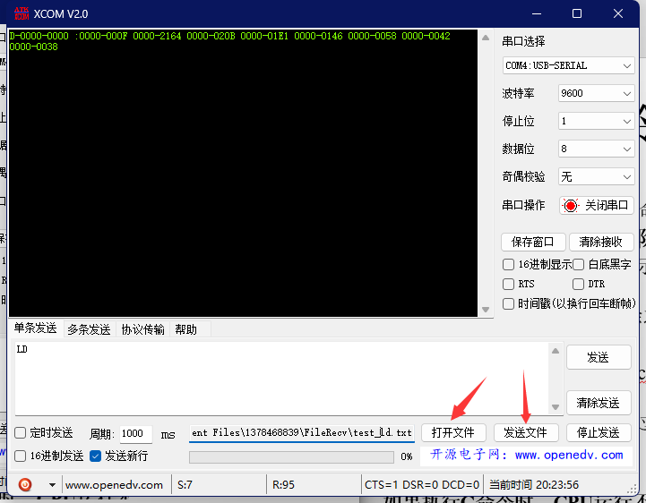

！！！注意，输入的文件必须满足以下格式：

- 必须是8位16进制数据
- 必须在文件结尾加入至少3个回车（为了加强文件结束的判断，代码实现是通过判断3个回车来判断文件结束的）

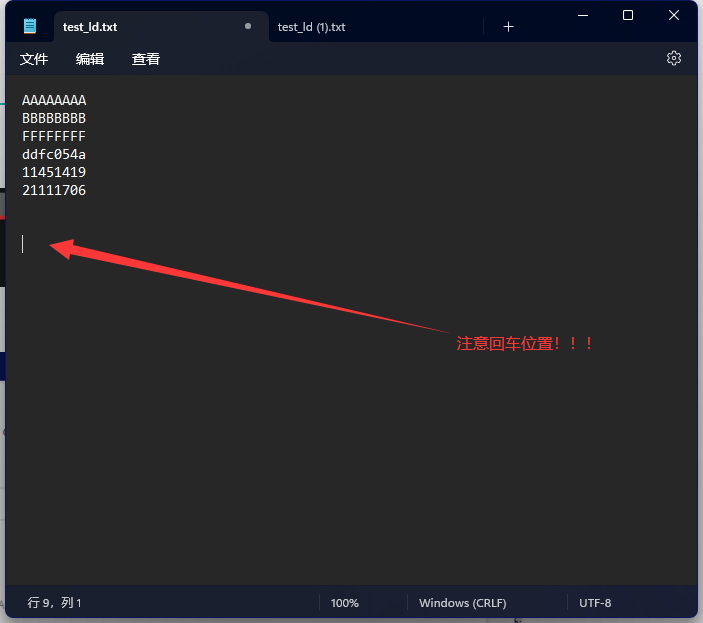

点击发送文件，显示Finish（如果没有Finish请检查文件格式，在文件结尾多打几个回车，多多益善）

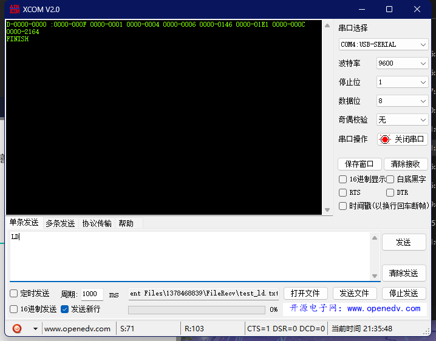

再次D查看数据存储器，发现数据已被写入：

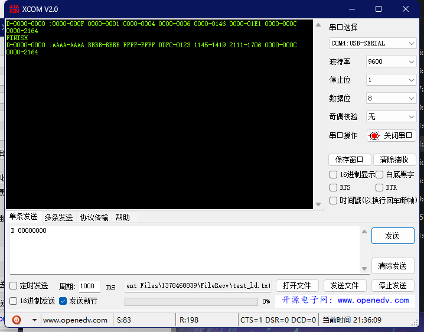

> 注意，数据写入只会覆盖，不会把后续的数据全部清零！

## 该如何使用？

直接将文件夹new添加到工程中

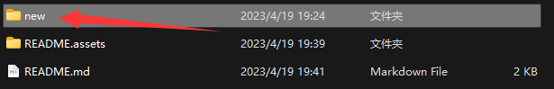

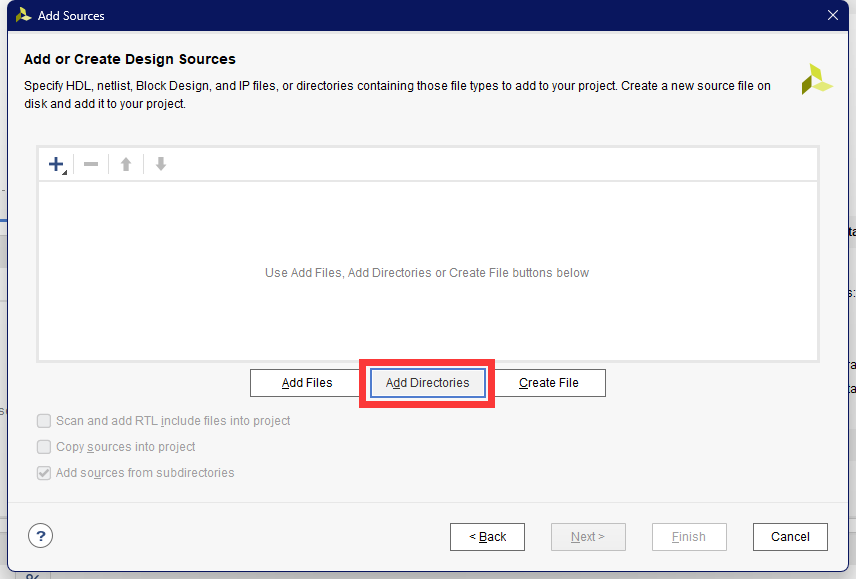

选择new文件夹即可，添加后工程目录应该如下所示：

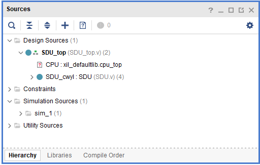

其中SDU_top为包含了你自己的单周期CPU和SDU调试单元的最顶层模块，其中CPU和SDU的所有接线已经为你接好了，只需要你把SDU_top中的CPU模块替换成自己的CPU模块。

改好CPU后，你的RTL电路应该长成这样：


再添加文件夹中的uart.xdc文件，烧录bitstream即可上板测试:

1. 打开文件夹中的PC端异步串行通信程序_XCOM_V2.0.exe，打开后界面如下：
   
   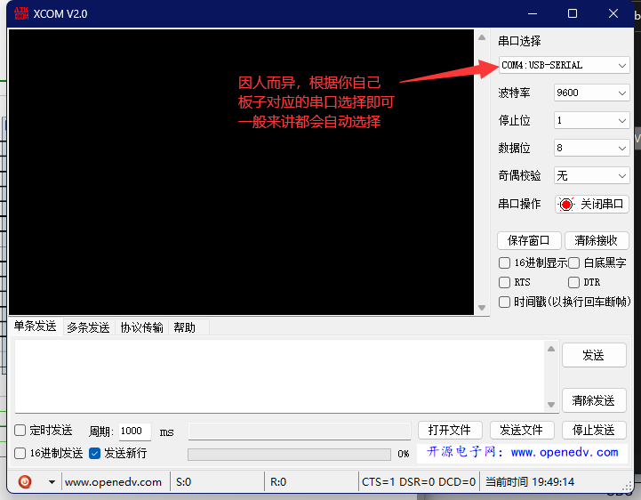

2. 可以使用单条发送，不过每次更改指令需要不断重新输入比较麻烦，在实际使用中，多条发送比较方便：（但并不是真的单条发送，实际上还是一次只发送一条指令）
   
   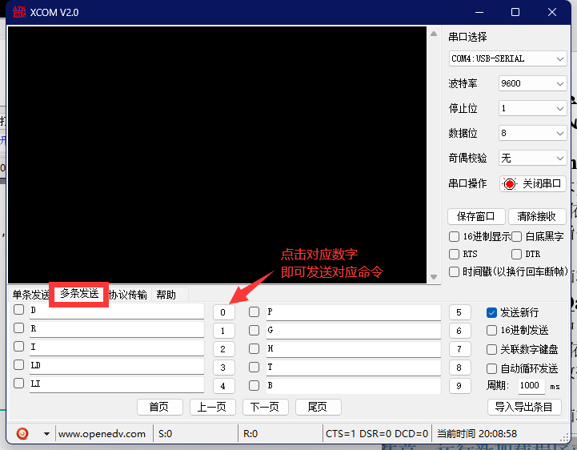

3. 之后就可以愉快的开始调试了~😄
   
   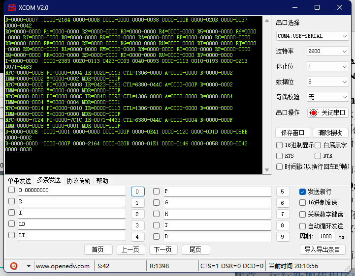