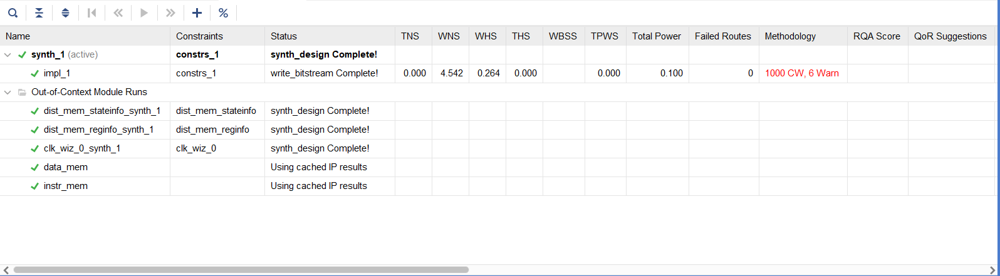
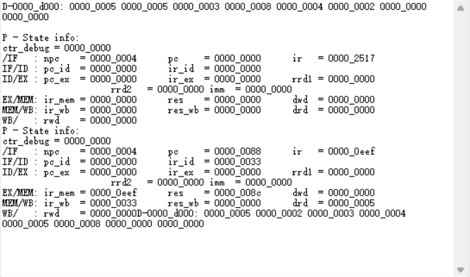

## LABH5 Report  

### 实验目的及内容

- 本次实验是设计流水线CPU数据通路并实现一个支持18条指令的流水线CPU。

### 逻辑设计

- 数据通路设计
  
  
  

> 该数据通路与书中的不尽相同，主要体现在`npc`的生成和控制信号的生成。

- 数据通路大致可以分为五个部分：由四个段间寄存器分离开。

  - `IFID`之前：由`pc`更新选择器和指令寄存器组成

    - `pc`更新选择器：在正常的无Hazard情况下，`pc`将会一直被更新为`pc+4`，否则若正在处理跳转指令，则`pc`被更新为跳转目标，选择器选择`IDEX`段的`npc`。
    - 指令寄存器：基本只要考虑读端口。。。不做赘述。

  - `IDEX`到`EXMEM`段：涉及了译码、控制译码、寄存器堆、立即数生成器

    - `Decode`：由于`risc-v RV32I`指令具有对齐性，指令的对应位置即为源寄存器编号`rs1,rs2`、目标寄存器编号`rd`。

    - `Control`：由指令二进制码翻译出对应的指令以及控制信号：

      ```v
      output reg [2: 0] ExtOp,    //选择立即数产生器的输出类型
      output reg [2: 0] Branch,   //说明分支和跳转的种类，用于生成最终分支控制信号
      output reg        MemRead,  //控制是否能读出数据存储器的内容
                                  //不会接进存储器，是作为一个信号指示lw指令
      output reg        MemWrite, //控制是否写入数据存储器，为1时写入数据存储器
      output reg [3: 0] ALUsrc,   //选择ALU执行的操作
      output reg        ALUAsrc,  //选择ALU输入端A的来源。为0时选择rs1，为1时选择PC。
      output reg [1: 0] ALUBsrc,  //选择ALU输入端B的来源。为00时选择rs2，为01时选择imm(当是立即                             //数移位指令时，只有低5位有效)，
                                  //为10时选择常数4（用于跳转时计算返回地址PC+4
      output reg        MemToReg, //选择寄存器rd写回数据来源，为0时选择ALU输出，为1时选择数据存储                             //器输出
      output reg        RegWrite  //控制是否对寄存器rd进行写回，为1时写回寄存器
      ```

    - `Registers`：要实现**写优先**型的寄存器堆，所以在读地址和写地址相同时，需要先保证读数据的正确，再在下一周期写入：

      ```v
      always @(*) begin
              if(RegWrite) begin
                  reg_1 = ((rs1 == rw) && (rw != 0)) ? busW : rf[rs1];
                  reg_2 = ((rs2 == rw) && (rw != 0)) ? busW : rf[rs2];
                  dout_rf = ((addr == rw) && (rw != 0)) ? busW : rf[addr];
              end
              else begin
                  reg_1 = rf[rs1];
                  reg_2 = rf[rs2];
                  dout_rf = rf[addr];
              end
          end
      ```

      当然，由于`x0`号寄存器总是`0`，要把它排除在写地址之外。

    - `Imm_Gen`

      根据指令判断立即数类型（I、U、S、B、J），然后译码（包括加位减位）。

      ```v
      assign immI = {{20{instr[31]}}, instr[31:20]};
      assign immU = {instr[31:12], 12'b0};
      assign immS = {{20{instr[31]}}, instr[31:25], instr[11:7]};
      assign immB = {{20{instr[31]}}, instr[7], instr[30:25], instr[11:8], 1'b0};
      assign immJ = {{12{instr[31]}}, instr[19:12], instr[20], instr[30:21], 1'b0};
      ```

  - `EXMEM`段到`MEMWB`段：处理`ALU`计算、`npc`计算、前递处理、`Hazard`处理：

    - `ALU`

      `ALU`的源操作数比较复杂，`Control`传来了`ALU`源操作数的选择信号，如第一个源操作数是寄存器读出结果还是`pc`，第二个源操作数是寄存器读出结果、立即数还是`4`（`jal`等指令要把下一条`pc`传回寄存器堆），但是还需要`Forward`模块传来前递选择信号，判断寄存器源是正常的读结果还是前递的，大致的选择方式如下：

      

    - `npc_Gen`

      由`Branch`模块产生选择`pc`的信号，`Branch`模块接收了来自`ALU`的结果，判断是否要跳转，再根据跳转类型选择对应的信号：

      > 顺序执行：NextPC = PC + 4；
      >
      > jal： NextPC = PC + imm;
      >
      > jalr： NextPC = rs1 + imm;
      >
      > 条件跳转： 根据ALU的Zero和Less来判断，NextPC可能是PC + 4或者 PC + imm；

      再根据选择信号由多选器和加法器得出`npc`，大致选择方式如下：

      

    - `Forward`

      前递信号由`Forward`模块得出。前递条件书本中已经给出，翻译成`Verilog`语言即可：

      ```v
      always @(*) begin
              /*
                这里if_elseif结构其实也解决了前递冲突的问题
                如两个前递条件均满足的时候，自然想要更近的前递
                这个结构恰好满足该要求
              */
              if((EXMEM_RegWrite) && (EXMEM_rd != 0) && (EXMEM_rd == IDEX_rs1)) begin
                  ForwardA = 2'b01;
              end
              else if((MEMWB_RegWrite) && (MEMWB_rd != 0) && (MEMWB_rd == IDEX_rs1)) begin
                  ForwardA = 2'b10;
              end
              else begin
                  ForwardA = 2'b00;
              end
      end
      ```

      要注意的是，这种`if elseif`结构恰好解决了前递的一个冲突问题：

      ```assembly
      addi x1, x0, 0
      addi x1, x1, x2
      addi x1, x1, x3
      ```

      这种情况下第三条指令两个前递条件均满足，可能导致前递冲突。但是显然我们需要把第二条指令的`rd`前递给第三条指令，上述`if elseif`结构恰好满足这个要求。

    - `Hazard`
    
      包括`Load-Use Hazard`和`Branch Hazard`。
    
      > `Load-Use Hazard`是由于在`lw`指令之后立刻需要使用`lw`的目标寄存器，但是这种情况无法使用前递解决，因为这种使用具有时序上的逆向性，必须让`lw`运行到`EX`段（即`Hazard`检测出是`lw`指令），此时将`pc`和`IFID`段间寄存器停顿（`stall`）一个时钟周期，在下一周期再取下一个`pc`操作，这样可以解决`Load-Use Hazard`。
      >
      > `Branch Hazard`是由于分支指令导致的冒险，本实验中没有要求使用较为高级的分支预测处理方法，而是简单的等待分支指令运行到`EX`段，将`IFID`段间寄存器和`IDEX`段间寄存器清空，强制使此时`pc`选择`npc`作为下一条`pc`而不是`pc+4`，这样做实际上有悖于流水线原理，这样做浪费了两个周期处理了无用了指令，但是为了简单起见，我们还是采用了这种类似单周期的处理方法。
    
  - `EXMEM`段到`MEMWB`段：读写数据存储器，不做赘述，注意前递信号。
  
  - `MEMWB`段之后：选择写回到寄存器的源，不做赘述，注意前递信号。

- 数据相关

  数据相关包括写后读（WAR），读后写（RAW），写后写（WAW）

  - WAR
  
  - 写进寄存器后读该寄存器，可能导致读出错误
  
    ```assembly
      lw x1,0(x2)
    add x3,x1,x3
    ```

    - 写进数据存储器后读该数据存储器，可能导致读出错误
  
      ```assembly
      sw t1, 0(t0)
      lw t2, 0(t0)
      ```
  
      
  
  - RAW
  
    包括EX段冒险和MEM段冒险。
  
  特殊的冒险：
  
  ```assembly
    addi x1,x1,1
    addi x1,x1,2
    addi x1,x1,3
  ```
  
    这种情况下可能导致两种冒险成立条件同时满足，但是要处理最近的EX冒险而不能处理较远的MEM冒险。
  
  - WAW
  
    如R型指令提前写回，实际上我们实现的流水线是统一在第五个周期WB段写回，所以类似WAW的数据冒险不会导致数据冒险。
  
    ```assembly
    lw x1,0(x2)
    add x1,x2,x3
  ```
  
  两条写入x1的指令会先后执行，最终保存的是add对应的结果。
  
| 右侧在前/下方在后           | addi/add/and/sub/or/xor | lui/auipc | slli/srli/srai | lw                   | sw      | beq/blt/bltu | jal     | jalr    |
  | --------------------------- | ----------------------- | --------- | -------------- | -------------------- | ------- | ------------ | ------- | ------- |
| **addi/add/and/sub/or/xor** | RAW相关                 | RAW相关   | RAW相关        | WAR相关              | 无相关  | 无相关       | RAW相关 | RAW相关 |
  | **lui/auipc**               | 无相关                  | 无相关    | 无相关         | 无相关               | 无相关  | 无相关       | 无相关  | 无相关  |
  | **slli/srli/srai**          | RAW相关                 | RAW相关   | RAW相关        | WAR相关              | 无相关  | 无相关       | RAW相关 | RAW相关 |
  | **lw**                      | （WAW相关），RAW相关    | RAW相关   | RAW相关        | WAR相关，（WAW相关） | WAR相关 | 无相关       | RAW相关 | RAW相关 |
  | **sw**                      | RAW相关                 | RAW相关   | RAW相关        | WAR相关              | 无相关  | 无相关       | RAW相关 | RAW相关 |
  | **beq/blt/bltu**            | RAW相关                 | RAW相关   | RAW相关        | WAR相关              | 无相关  | 无相关       | RAW相关 | RAW相关 |
  | **jal**                     | 无相关（WAW相关）       | 无相关    | 无相关         | 无相关               | 无相关  | 无相关       | 无相关  | 无相关  |
  | **jalr**                    | RAW相关                 | RAW相关   | RAW相关        | WAR相关              | 无相关  | 无相关       | RAW相关 | RAW相关 |

  

- 仿真结果

  证明是流水线：

  

  运行完排序之后在汇编程序的最后使用若干lw指令将存储器中的数据加载出来，初始存储器的数据如下（第一位是数组长度）：

  ```tex
  memory_initialization_radix = 16;
  memory_initialization_vector = 
  00000005
  00000005
  00000003
  00000008
  00000004
  00000002
  ```

  排序之后仿真结果如下：

  

- 结果分析

  从仿真结果可以看到，排序的结果正确。

### 电路设计及分析

- 完整`RTL`电路图

  

- 资源使用情况

  

### 测试结果及分析

- 上板结果，使用SDU测试

  - 助教给的测试hazard的程序：

    SDU结果：

    

  ​        使用RARS跑出来的结果是：
  
  ​        
  
  ​        
  
  ​        **可以看到最终结果是相同的**。
  
  - 测试程序，当最后寄存器堆的`x30`变为`1`则表示`18`条指令全部正确。
  
    
  
  - 排序程序：排序完成前后各查看一次存储器的值：
  
    

### 总结

> 本次实验难点主要在于数据通路的设计和处理好冒险，调试较为简单。
