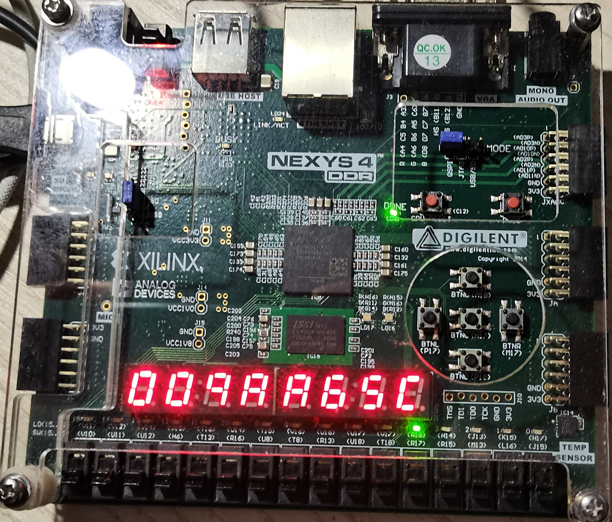

# LABH6 Report

> 姓名：王道宇
>
> 学号：`PB21030794`
>
> 日期：`2023/6/12`

## 目录
[实验目的及内容](#实验目的及内容)
[逻辑设计](#逻辑设计)
- [cache的设计](#cache的设计)
- [cache状态机的设计](#cache主状态机以直接映射为例)
- [多路组相联cache的设计](#多路组相联cache的设计)
- [主存的设计](#主存datamem)
- [IOU的设计](#iou的设计)
- [汇编代码的设计](#汇编代码测试程序的设计)

[仿真结果与分析](#仿真结果及分析)
- [仿真结果](#仿真结果)

[电路设计与分析](#电路设计及分析)
- [完整RTL图](#完整rtl电路图)
- [资源使用情况](#资源使用情况)

[测试结果与分析](#测试结果及分析)
- [上板结果](#上板结果)
  - [直接映射块大小4字](#直接映射块大小为4字)
  - [直接映射块大小8字](#直接映射块大小为8字)
  - [二路组相联映射块大小4字](#二路组相联块大小为4字)
  - [二路组相联映射块大小8字](#二路组相联块大小为8字)
- [对比和分析](#对比和分析)

[总结](#总结)


## 实验目的及内容

- 本次实验为**综合实验**，目的是在`LABH5`的`risv-32I`五级流水线基础上增加：

  - 数据缓存模块：包括直接映射型缓存和多路组相联型缓存；
  - `IOU`模块：输入输出模块，实现通过存储器映射的输入输出（`mmio`），采用**轮询**的方式从开关获得输入数据或输出数据到数码管；同时，采用**直接输入输出**方式从各个按钮获得输入信号或输出数据到`LED`灯。

  加上两个模块之后，我们已经实现了一个初具雏形的`CPU`系统，它拥有基本输入输出，拥有缓存机制，并通过开发板的外设与现实的使用者建立关系。

  实验的测试程序是`1000`个随机数的排序。

- 实验过程中需要使用`SDU`串行调试工具对`CPU`进行调试，提供`CPU`运行信号和运行时钟，并在运行结束之后查看寄存器和存储器的数据判断`CPU`工作是否正常，并通过`debug`信号得到总访存次数和`cache miss`的次数，计算得到`cache miss`率。

- 实验需要通过改变缓存的组数、行数、块大小等参数得到多组运行排序的时间`count`和`cache miss`率，通过比较这两个结果评估不同参数对`cache`的影响。

  > 在本实验中我选取了以下四种`cache`配置：
  >
  > 首先固定`cache`的规模是`1KB`，主存的规模是`4KB`
  >
  > | 组相联度位 | 标签位 | 行数位 | 块大小位 |
  > | ---------- | ------ | ------ | -------- |
  > | 0          | 2      | 6      | 2        |
  > | 0          | 2      | 5      | 3        |
  > | 1          | 3      | 5      | 2        |
  > | 1          | 3      | 4      | 3        |
  >
  > > - “······位”代表用多少位（bit）去描述该参数，故对应关系为：a位对应该参数大小为$\space 2^a$，在下文可以看到这样定义的目的。
  > > - 下文以“**字**”表示缓存或主存的一个数据，大小为`32bits`（`4B`）

## 逻辑设计

### `cache`的设计

关于各位宽的综述：

1. 首先在`Cache`模块起始定义了一系列常量：

   ```verilog
   parameter WAY_ADDR_LEN = 0,                         
   parameter TAG_LEN = 2,                             
   parameter INDEX_ADDR_LEN = 6,                       
   parameter LINEWORD_ADDR_LEN = 2,                   
   parameter MEM_ADDR_LEN = TAG_LEN + INDEX_ADDR_LEN   
   ```

   - `WAY_ADDR_LEN`：组相联位宽
   - `TAG_LEN`：标签位位宽
   - `INDEX_ADDR_LEN`：行数位宽
   - `LINEWORD_ADDR_LEN`：块大小（4字或8字）
   - `MEM_ADDR_LEN`：传给主存的读写地址位宽（在主存中还要做扩展）

2. 对于固定总容量`1KB`的缓存中，按字节寻址的方式中，寻址范围即为`0 ~ 1K`，所以上述变量之间必须满足下列关系：
   $$
   (LINEWORD\_ADDR\_LEN + 2) + INDEX\_ADDR\_LEN + WAY\_ADDR\_LEN = 10
   $$
   > 其中$\space + 2\space$表示一个字是`4B`，需要`2`位位宽去按字节访问每个字节。
   
   这也可以得出缓存规模为：
   $$
   2^{LINEWORD\_ADDR\_LEN + 2} \times 2^{INDEX\_ADDR\_LEN} \times 2^{WAY\_ADDR\_LEN} = 1K
   $$
   与我们`cache`的配置一致。

   同时，对于组相联`cache`，有如下关系：
   
   `WAY_ADDR_LEN`每多一位，`INDEX_ADDR_LEN`少一位，`TAG_LEN`多一位。
   
3. 对于`4KB`的主存，每个数据`32bits`的情况下，寻址范围即为`0 ~ 1K`，也就是`addr[9: 0]`，所以上述常量之间必须满足下列关系：
   $$
   TAG\_LEN + INDEX\_ADDR\_LEN + LINEWORD\_ADDR\_LEN = 10
   $$
   同时，由于缓存和主存的数据传输以块为单位，所以`cache`传给主存的地址`MEM_ADDR_LEN`只需要`TAG_LEN + INDEX_ADDR_LEN`位就可以，单块中的字偏移在主存模块中处理。

综上，我们得到`cache`的关键寄存器堆的定义方式：

```verilog
reg [WORD_SIZE - 1: 0] Cache    [0: INDEX_SIZE - 1][0: LINEWORD_SIZE - 1];
reg [  TAG_LEN - 1: 0] CacheTag [0: INDEX_SIZE - 1];
reg                    Valid    [0: INDEX_SIZE - 1];
reg                    Dirty    [0: INDEX_SIZE - 1];
```

经过前文的介绍，这里的寄存器堆定义也较为明了。

### `Cache`主状态机（以直接映射为例）：

首先，当`EX`段的地址和请求信号传到`cache`时，首先需要对地址做切分，切分方式如下：

  ```verilog
  // 拆分输入地址
  wire [  UNUSED_ADDR_LEN - 1: 0] unused_addr;
  wire [          TAG_LEN - 1: 0] tag_addr;
  wire [   INDEX_ADDR_LEN - 1: 0] index_addr;
  wire [LINEWORD_ADDR_LEN - 1: 0] lineword_addr;
  wire [                2 - 1: 0] word_addr;
  assign {unused_addr, tag_addr, index_addr, lineword_addr, word_addr} = addr - 32'h0000_2000;
  ```

切分完地址之后需要判断`cache`的`hit`情况，在直接映射中只需要比较该行的`tag`域是否输入地址的`tag`域相等同时数据有效即可。

  ```verilog
  always @(*) begin
      if(CacheTag[index_addr] == tag_addr && Valid[index_addr]) begin // 如果tag相同                                                                            且数据有效
              cache_hit = 1'b1;
          end
          else cache_hit = 1'b0;
      end
  ```

再得到这些关键信息之后，可以进入`cache`数据交换状态机工作。

  - 对`cache`的读请求：
  
    采用异步读方式，相当于分布式`cache`的处理方法，无需读使能，读出数据的有效性由是否`cache hit`决定。如果`cache miss`，流水线会被停顿，读出的错误数据无法继续沿流水线向下传。
  
    ```verilog
    assign rd_data = Cache[index_addr][lineword_addr];
    ```
  
  - 对`cache`的写请求：
  
    写请求较为复杂，在状态机的不同状态会有不同的写操作。

下列是`cache`与主存交换数据状态机，具体有些信号下文会提及：


### 多路组相联`cache`的设计

在多路组向量`cache`中，由于实验要求实现`LRU`最近最少使用的替换策略，首先在`cache`模块中，需要将所有关键寄存器加一个维度：`[0: WAY_CNT - 1]`用于标志多路情况，其次，需要实现一个`LRU`栈用于维护一个使用次数排序栈，栈顶为最近使用的组编号，栈底为最少使用的编号。

在`cache hit`时，需要先寻找`cache hit`的是那一个路并保存该路编号（`hit_pos`），并在栈中找到该路编号（`hit_pos`）在栈中的位置（`whick_stackpos_hitpos_in`），将栈中从栈顶到该位置之前的所有位置的数据向后移动一位（栈顶空出来），并将栈顶设置成`hit_pos`，表示该路编号是最近使用的。

在`cache miss`时，需要分情况讨论：

  - 当栈不满时，直接将未访问过的路编号加进`stack`中（当然也要维护一个栈当前长度的寄存器堆`LRU_stack_size`）：

    ```verilog
    if(LRU_stack_index_size < WAY_SIZE) begin
    	swap_way_number <= LRU_stack_index_size;
    	cache_state <= SWAP_IN;
    	LRU_stack_size[index_addr] <= LRU_stack_index_size + 1;
        LRU_stack[index_addr][LRU_stack_index_size] <= LRU_stack_index_size;
    end
    ```

    > 其中`LRU_stack_index_size = LRU_stack_size[index_addr]`
    >
    > `swap_way_number`是马上`cache`要被写入一块数据的组编号

  - 当栈满时，如果满足换出条件，则需要将栈底的那一路中的块换出用于放新的块：

    ```verilog
    else begin
        swap_way_number <= LRU_way_number;
        if(Valid[index_addr][LRU_way_number] && Dirty[index_addr][LRU_way_number]) begin
            // 当有读写请求且该位置数据有效且脏(与主存不同时)，需要先将cache中的数据写回主存
        	cache_state <= SWAP_OUT;
            mem_wr_addr<= { CacheTag[index_addr][LRU_way_number], index_addr };      
            // 准备写回主存的地址
            for(j2 = 0;j2 < LINEWORD_SIZE;j2 = j2 + 1) begin
                mem_wr_line[j2] <= Cache[index_addr][LRU_way_number][j2];            
                // 准备写回主存的数据
            end
        end
    	else begin
            cache_state <= SWAP_IN;
        end
    end
    ```

    > 其中`LRU_way_number`代表最近最少使用的路编号(0 ~ WAY_SIZE - 1)，在LRU栈中是最后一位的值
    >
    > ```verilog
    > assign LRU_way_number       = LRU_stack[index_addr][WAY_SIZE - 1];
    > ```

### 主存（`DataMem`）

由于`cache`会向主存发送读或写信号，并且由实验要求，在访问使用块式存储器例化的主存时，首字延迟需要`16`个周期，之后每隔一个周期读一个字（虽然这个假设也有点不大合理，在总结中具体讨论），以用来模拟`cache miss`的巨大延迟和严重后果，同时模拟访问`cache`和主存之间巨大的性能和延迟差异。

为了实现延迟和读写，我们使用状态机来描述这个过程，这个状态机比较简单，并且相当于串行运行，不画了。

  > 这里最需要注意的是块式存储器的读是同步读的，一个时钟上升沿读取该上升沿**前面的**地址，下一个时钟上升沿**之后**才会将地址读出，这也意味着如果地址一直随时钟递增，那么此处的数据与此时的地址已经偏移两位了，对应关系如下：
  >
  > ```verilog
  > if(rd_count <= LINEWORD_SIZE) begin
  > 	rd_count <= rd_count + 1;
  >     if(rd_count > 1) begin
  >     	rd_line[rd_count_2[LINEWORD_ADDR_LEN - 1: 0]] <= rd_word;
  >     end
  > end
  > else begin
  >     rd_line[rd_count_2[LINEWORD_ADDR_LEN - 1: 0]] <= rd_word;        
  >     // 此时rd_count_2 == rd_count - 2 = LINEWORD_SIZE + 1 - 2 = LINEWORD_SIZE - 1
  >     rd_state <= RD_HANDSHAKE;
  > end
  > ```
  >
  > 这里当然有：
  >
  > ```verilog
  > assign rd_count_2 = rd_count - 2;
  > ```

### `valid-ready`协议
 `cache`与主存间的通信和传输数据遵循`valid-ready`协议：

  - 数据源准备好数据，则置`valid`有效；
  - 接受端准备好接受数据，则置`ready`有效；
  - 时钟采样沿`valid`和`ready`均有效时，完成数据传输；

考虑到`cache`与主存之间互有读写，`cache`需要交换数据写回主存时，`cache`是**数据源**，主存是**接收端**；当`cache`需要从主存中读块时，`cache`是**接收端**，主存是**数据源**。所以为了统一起见，我没有使用`valid`和`ready`这两个信号（不好区分读写信号且每一端两个信号都有），转而使用另一种形式的`valid-ready`协议：`cache`向主存发送读写信号，这两个信号由状态机处于哪个阶段而决定，处于`SWAP_OUT`则为写信号，处于`SWAP_IN`则为读信号。而主存只向`cache`发送`handshake`（握手信号），表明`cache`需要写回的数据已经完全写入主存，或者`cache`要读的那一块的数据已经准备完毕。一旦有`handshake`信号，表明`cache`可以进入下一个状态了。

在这种方式中，`valid-ready`体现在：

  - `cache`需要交换数据写回主存时，`cache`是**数据源**，主存是**接收端**：

    主存作为目标端，`ready`其实一直是`1`，因为写端口一直有效，此时，当`cache`跳到`SWAP_OUT`状态时，表示`cache`已经准备好了要写回的数据和地址，并且向主存发出了写信号，这些作为`valid`信号一直被保持，直到写回完成，主存发出`wr_handshake`信号，表示该次数据传输成功。

  - `cache`需要从主存中读块时，`cache`是**接收端**，主存是**数据源**：

    此时，当`cache`跳到`SWAP_IN`状态时，就相当于`ready`已经被置`1`了，`cache`已经准备好接收数据了，同时给主存发送读信号，当主存准备好`cache`要读的信号之后，发出`rd_handshake`信号，这其实表示主存的`valid`信号，在这两个信号都有效的时钟边沿，`cache`跳到`WRITE_TO_CACHE`状态，表明这次数据传输成功，`cache`接下来要把从主存读出来的数据写到自己的寄存器堆中去了。

所以，看似没有使用`valid-ready`这两个符号，但是其实本质相同，并且实现了在接收端准备好就置位`ready`，这样在`valid`置位一个周期之后就能完成数据传输，提高了效率。

  > 注意：对于每个`ld`或`sw`访存指令，在`cache miss`时不一定需要换出`SWAP_OUT`，但一定需要换入`SWAP_IN`

### `IOU`的设计

 `IOU`的设备较多，与`CPU`的输入输出关系比较复杂，下文将外设（如按钮，开关）向`CPU`输入数据（如数组大小，首字）的过程称作**输入过程**，将`CPU`得出的某些结果（如排序周期数，排序是否正确，排序进行到的步骤灯）放入寄存器输出到外设（如数码管和`LED`灯）的过程称作**输出过程**。

  显然，输入过程使用`lw rd,offset(rs)`，输出过程使用`sw rs1,offset(rs2)`，具体的`mmio`地址表如下，假设`mmio`首地址为`0x0000ff00`并存在`t0`寄存器中：

  | `offset` | `signal`   | `Write/Read` | `instruction`                       | `discription`            |
  | -------- | ---------- | ------------ | ----------------------------------- | ------------------------ |
  | `0x00`   | `led_data` | `W`          | `sw t1, 0x00(t0)`                   | `led[15: 0]`             |
  | `0x04`   | `swt_data` | `R`          | `lw t1, 0x04(t0)`                   | `五个btns and sw[15: 0]` |
  | `0x08`   | `seg_rdy`  | `R`          | `lw t1, 0x08(t0)`                   | `数码管准备好的信号`     |
  | `0x0C`   | `seg_data` | `W`          | `sw t1, 0x0C(t0)`                   | `给数码管输出的数据`     |
  | `0x10`   | `swx_vld`  | `R`          | `lw t1, 0x10(t0)`                   | `开关输入有效的信号`     |
  | `0x14`   | `swx_data` | `R`          | `lw t1, 0x14(t0)`                   | `开关输入的数据`         |
  | `0x18`   | `cnt_data` | `RW`         | `lw t1, 0x18(t0)` `sw t1, 0x18(t0)` | `计数器数据`             |

  这些信号中有两个需要注意：给数码管输出的数据以及开关输入的数据，首先，数码管不一定此时可以显示数据，因为可能数码管当前显示的数据还没有被查看或记录，必须使用者做一些操作表示已经看完这一次数码管显示的数据了（本实验中使用的是按任意一个开关或者`del(btnl)`键），才能显示下一个数据；而开关输入需要等待输入完毕，将有效信号置位，此时`CPU`才能读取开关上的数据，有效信号清零，本实验中开关输入完毕后按下`data(btnc)`键将有效信号置位。这种输入输出方式叫做**查询式输入输出**，具体的实现方式如下：

  - 代码中：

    ```verilog
    // 查询式输出过程
    always @(posedge clk, negedge rstn) begin
        if(!rstn) begin
            seg_rdy <= 1;                     // 复位时，IOU将数码管准备好标志(seg_rdy)置一
        end
        else if(io_we & (io_addr == 8'h0C)) begin
            seg_rdy <= 0;                     // CPU输出seg_data时，IOU保存该数据，同时将                                                seg_rdy清零
        end
        else if(del_PS | x_is_change) begin
            seg_rdy <= 1;                     // 按任意x或del，IOU将seg_rdy置一，表示数码管输                                              出数据已被查看，CPU可以输出另一个数据
        end
    end 
    ```

    ```verilog
    // 查询式输入过程
    always @(posedge clk, negedge rstn) begin
        if(!rstn) begin
            swx_vld <= 0;                        // 复位时，IOU将输入数据有效标志清零
        end
        else if(data_PS & !swx_vld) begin  
            swx_vld <= 1;                        // 按下btnc确认按钮，若此时输入数据有效标志为                                                 0，则将输入数据有效标记置一
        end
        else if(io_rd & (io_addr == 8'h14)) begin
            swx_vld <= 0;                        // 向CPU输入数据之后(CPU需要读外设之后)，要                                                 将输入数据有效标志清零，准备下一个输入
        end
    end
    ```

  - 汇编中：

    输出：

    ```assembly
    Check_Out1:
        lw  t1, 0x08(t0)
        beq t1, a1, Out1   # if seg_rdy == 1 jump to Out1
        jal a1, Check_Out1
    Out1:
        sw  a4, 0x0C(t0)        # DISP output
    ```

    输入：

    ```assembly
    Check_In1:
        lw  t2, 0x10(t0)   # swx_vld
        beq t2, a0, In1    # if swx_vld == 1 jump to In1
        jal a1, Check_In1
    In1:
        lw  t2, 0x14(t0)   # t2 is the size of the array
    ```

  其余的信号都不需要使用轮询方式。

### 汇编代码（测试程序）的设计

  汇编代码分为六部分：

  - 输入数组的大小和首字

  - 使用斐波拉契`LFSR`算法，根据数组的大小和首字得出伪随机的其余的数
  - 对这些数排序（本实验为`1000`个）
  - 输出排序的周期数
  - 清理`cache`中的`Dirty`位（每隔几个数`lw`一下，其实没有意义，因为检查排序结果的正确性已经做过这个事情了）
  - 检查排序结果的正确性（遍历数组看是否是升序），并输出正确或者错误信号到`LED`灯上

  具体代码都有注释。

## 仿真结果及分析

### 仿真结果

  

## 电路设计及分析

### 完整`RTL`电路图

  

  > 其中`u_CPU`是`CPU`模块，接出的线包括`clk`和`rstn`线、`debug`线、`IO_BUS`线；
  >
  > `SDU`（串行调试）是竞赛班同学写的模块，代码**风格一坨**，包括需要我们改造`PDU`模块为`IOU`，给的那个`PDU`模块也是**烂的一比**，什么变量、逻辑之类非常混杂，例化模块写的歪歪扭扭，甚至不会对齐，开始的时候给我们的`SDU`和`PDU`甚至关键变量没有注释，这里贴两段`PDU`模块的代码：
  >
  > ```verilog
  > reg [19:0] cnt_clk_r;   //时钟分频、数码管刷新计数器
  > reg [4:0] cnt_sw_db_r;
  > reg [15:0] x_db_r, x_db_1r;
  > reg xx_r, xx_1r;
  > wire x_p;
  > reg [3:0] x_hd_t;
  > ```
  >
  > ```verilog
  > always @(posedge clk_pdu, posedge rst) begin
  >  if (rst)
  >      cs <= STOP;
  >  else
  >      cs <= ns;
  > end
  > 
  > always @* begin
  >  ns = cs;
  >  case (cs)
  >      STOP: begin
  >          if (step_p)
  >              ns = STEP;
  >          else if (cont_p)
  >              ns = RUN;
  >      end
  >      STEP:
  >          ns = STOP;
  >      RUN: begin
  >          if (brk_addr_r == chk_pc)
  >              ns = STOP;
  >      end
  >      default:
  >          ns = STOP;
  >  endcase
  > end
  > 
  > always @(posedge clk_pdu, posedge rst) begin
  >  if (rst)
  >      run_r <= 1'b0;
  >  else if (ns == STOP)
  >      run_r <= 1'b0;
  >  else
  >      run_r <= 1'b1;
  > end
  > 
  > always @(negedge clk_pdu, posedge rst) begin
  >  if (rst)
  >      run_n <= 1'b0;
  >  else
  >      run_n <= run_r;
  > end
  > 
  > ```
  >
  > 首先，状态机没有任何的注释，其次，你猜`x_db_r`和`x_db_1r`代表什么？
  >
  > 。。。
  >
  > 开关去抖动结果，开关取边沿结果。。。
  >
  > 那你不能命名成：
  >
  > `x_DB`// 开关去抖动
  >
  > `x_PS`// 开关取边沿
  >
  > `x_DPE`// 开关去抖动，取边沿之后的编码值
  >
  > 好歹写个注释吧。

  ​                                                                                                                                                                                                                                                                                                                                                          

### 资源使用情况

  

​         

## 测试结果及分析

### 上板结果

  > `xcom`串行调试工具的`debug2`信号是总访存次数，`debug3`信号是`cache miss`数
  >
  > 开发板`LED`灯第`4`位亮时表示排序正确，第`5`位亮时表示排序错误。
  >
  > 显然应该有各个配置的总访存次数应该是一样的，因为运行的同一个程序，初始值也相同。
  >
  > 在具体测试中，为了保证每个配置的初始值相同，每一个配置总排序数输入`0x3e8`（1000），首字输入`0x2`（2）。

#### 直接映射，块大小为4字

排序周期为`0xbbc967`，总访存次数为`0xbaff7`，`cache miss`数为`0x1d24a`。
  
  

#### 直接映射，块大小为8字

排序周期为`0xb8ec7`，总访存次数为`0xbaff7`，`cache miss`数为`0x12a6f`。
  
  

#### 二路组相联，块大小为4字

排序周期为`0xa739a4`，总访存次数为`0xbaff7`，`cache miss`数为`0x1ba42`。
  
  

#### 二路组相联，块大小为8字

排序周期为`0x9aa65c`，总访存次数为`0xbaff7`，`cache miss`数为`0x0dca7`。
  
  

### 对比和分析

| 配置           | 块大小 | 排序周期数 | 总访存请求数 | cache miss数 | cache miss率 |
| -------------- | ------ | ---------- | ------------ | ------------ | ------------ |
| 直接映射       | 4字    | `0xbbc967` | `765943`     | `119370`     | `15.58%`     |
|                | 8字    | `0xa739a4` | `765943`     | `76399`      | `9.97%`      |
| 二路组相联映射 | 4字    | `0xb8ec47` | `765943`     | `113218`     | `14.78%`     |
|                | 8字    | `0x9aa65c` | `765943`     | `56487`      | `7.37%`      |

  可以得出以下结论：

  - **相同映射方式**下，块大小为8字的`miss`率比4字显著降低。
  - **相同块大小的情况**下，二路组相联映射的`miss`率比直接映射有降低，但不显著。
  - 二路组相联，4字的性能仍然比不上直接映射，8字。
  - **二路组相联，8字的性能最好，`miss`率最低。**

## 总结

> 关于为什么访问主存的首字延迟是16个时钟？
> 
> 与同学讨论之后得出了两个猜想：
> 
> - 因为PPT上给的块大小为4字，然后对应16个时钟，是否表明这个延迟与读块时块中的字节数相同？也就是说延迟时间与需要读的数据量成正比。那是> 否说明读块时，主存的访问不是按字访问，而是按字节访问？那主存的例化方式就得不同，需要例化成`4096 * 1B`而不是`1024 * 4B`。
> - 我的猜想是：这个延迟并与单块中的数据量无关，这个延迟只是一种模拟，因为在实际的`CPU`中，`cache`和主存的数据通信线可能较长，建立联> 系的时间会比较长，这个延迟是为了让这两个模块之间建立关系产生`valid-ready`信号。
> 
> 最终采用了第二种猜想。


本次实验学到了如何实现缓存和输入输出的技术细节，难度和复杂度较大，`cache`的实现比较困难，仿真难度较高，测试数据比较困难（生成`bit`流加上排序加上看排序结果一次大概需要10分钟），试错成本高。作为三周的综合实验这个难度确实也比较难以接受。前前后后一共忙了一周半（指第一周摸鱼，第二周前半学习`cache`，后半到第三周前半完成了编写，仿真，综合，上板，调参等一系列过程），最终也是在检查前三天得到最终所有的数据，前两天完成了该实验报告。

***完结撒花！！！！***
